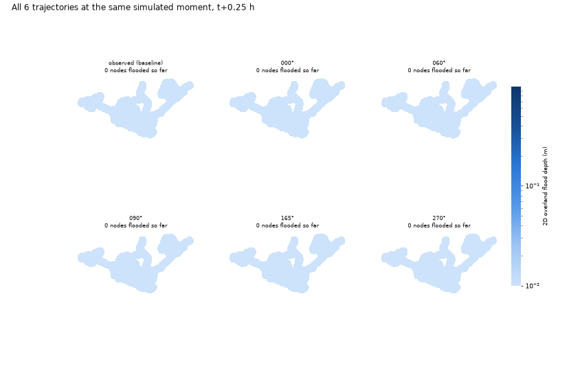

# Rainfall Trajectory Lab

Does the *path* a storm takes across a city change how it floods, even when the total rainfall is identical?

This lab takes one real convective storm recorded over the Bellinge catchment in Odense, Denmark, makes nine copies
of it traveling along nine different compass bearings, forces every copy to deliver an identical total volume of
water, and runs each through a coupled 1D/2D model of the real drainage network. Because rainfall volume is held
fixed, any difference in the resulting flooding can only have come from the direction of travel.



The animation above is the part of the lab that uses the engine's reentrant design directly. Six storms are opened
at once, each holding its own `Solver`, and all six are stepped forward together through the same sequence of
checkpoints. Every panel shows the same instant in simulated time, so you are watching six possible futures of the
same catchment rather than six finished runs replayed side by side.

## What the lab covers

| Part | Topic |
| --- | --- |
| 1 | The Bellinge drainage network |
| 2 | Pulling a real storm out of an X-band radar archive, including the quality check that rejects a corrupt record |
| 3 | Taylor's frozen field hypothesis, used to turn one observed storm into nine trajectories |
| 4 | Building a triangular surface mesh from a DEM and coupling it to the pipe network |
| 5 | A single test run, and what continuity error actually tells you |
| 6 | Running the full nine-storm ensemble |
| 7 | Six engines held open simultaneously in one process |
| 8 | Comparing the outcomes |

## Data

**The Bellinge dataset is not distributed with this repository.** It is third-party published data with its own
license and citation requirements, so please obtain it from the original source:

Nedergaard Pedersen, A., Wied Pedersen, J., Vigueras-Rodriguez, A., Brink-Kjær, A., Borup, M., and
Steen Mikkelsen, P. (2021). *The Bellinge data set: open data and models for community-wide urban drainage systems
research.* Earth System Science Data, 13(10), 4779–4798. https://doi.org/10.5194/essd-13-4779-2021

Once you have a copy, point the lab at it:

```bash
export BELLINGE_DATA_DIR=/path/to/Bellinge
```

Alternatively place the dataset at `data/Bellinge` inside this folder, which is the default location and is
gitignored. Either way the lab expects to find these three things underneath it:

```
7_SWMM/BellingeSWMM_v021_nopervious.inp   the drainage model
Local_X-band/                              58 radar pixel files
output_SRTMGL1.tif                         elevation raster covering the catchment
```

If any of them is missing, `config.require_data()` raises a message naming the paths it looked for rather than
failing deep inside a parser later on.

## Environment

The lab needs `openswmm.engine` built with 2D surface routing enabled, which is not the default in the published
wheel. Build it from source with:

```bash
CMAKE_ARGS="-DOPENSWMM_BUILD_2D=ON -DVCPKG_MANIFEST_NO_DEFAULT_FEATURES=ON -DVCPKG_MANIFEST_FEATURES=2d" \
  pip install ./python
```

Then verify with `python -c "from openswmm.engine import HAS_2D; assert HAS_2D"`.

The remaining dependencies are in `environment.yml`:

```bash
conda env create -f environment.yml
conda activate openswmm2d
```

## Running it

```bash
cd Notebooks/Rainfall_Trajectory_Lab
export BELLINGE_DATA_DIR=/path/to/Bellinge
jupyter lab bellinge_storm_trajectories.ipynb
```

Run the cells in order. Expensive stages are cached under `cache/`, so a second pass through the notebook reuses
completed work. Set `FORCE_RERUN = True` in the setup cell to recompute everything from scratch.

Expect roughly 6 minutes for the nine-storm ensemble and another 4 to 5 minutes for the six-engine live run on a
laptop. Both are cached afterward.

## A note on parallelism

`config.N_WORKERS` is set to 1, meaning the ensemble runs one simulation at a time. Running several engines as
separate operating system processes crashed reliably during development, taking down workers partway through and
leaving the pool waiting on results that never arrived. The cause sits in a shared native library during startup
rather than in the model, and a single simulation on its own never had trouble. Part 7 gets its concurrency a
different way, by holding several engines inside one process, which avoids the problem entirely. Raise `N_WORKERS`
only if you have verified it is stable on your platform.

## Layout

```
bellinge_storm_trajectories.ipynb   the lab itself, with saved outputs
swmm_storm/                         supporting package
  config.py                         paths, event window, tunable constants
  inp_utils.py                      minimal SWMM .inp section reader and writer
  radar.py                          radar archive to space-time rainfall cube
  advection.py                      storm motion, frozen field footprint, trajectory synthesis
  mesh.py                           DEM to triangle mesh, boundary conditions, node coupling
  model.py                          per-realization .inp assembly
  run.py                            ensemble driver and the live multi-engine runner
  figures.py                        mesh figure, box plots, animation
scripts/
  build_notebook.py                 regenerates the notebook from source strings
  run_ensemble.py                   runs the nine-storm ensemble outside Jupyter
media/                              GIF of the Part 7 animation
```

The notebook is generated from `scripts/build_notebook.py` rather than edited by hand. If you change the prose or
the cells, edit that script and re-run it, then execute the notebook to refresh the outputs.

## Limitations worth knowing before citing anything here

The terrain is represented at 30 meters with no buildings, so flood depths compare trajectories against each other
and should not be read as street level predictions. The frozen field reconstruction captures the storm's overall
movement well and its internal growth and decay poorly, which the R squared diagnostics in Part 3 quantify. And this
is one storm over one catchment, so the size of the effect found here does not transfer to another site, although
the question is worth asking wherever you work.
